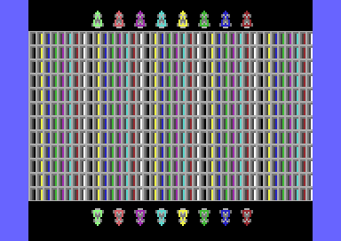

# `C64ColorRamDoubleBuffer`

This project is an example implementation of a double buffer for the Commodore 64 color ram, it uses character mode.

The first 12 even lines of the screen memory and the color ram are buffer 0, the first 12 odd lines are buffer 1. Character size ist 8x16, the upper 8x8 part of a character number x is defined by charset 0, the lower 8x8 part is defined by the same character number x in charset 1. So the character screen consist of 8x16 character size times 12 lines (=24 lines in standard mode) and the number of columns remains the standard 40 columns.

The example works for all VIC-II types (pal, ntsc, drean, etc.).

The main purposes of this implementation:
* understand the double buffer idea better by looking at an example
* inspiration and good starting point for your own use-cases

Known implementation restrictions: sprites can disturb the raster timing depending on their position and their sprite number. If you need multiple sprites with random positions for your use-case then the raster line timing must be adapted.

## Quickstart Guide

1. Compile the program

    ```console
    cd src
    acme -o C64ColorRamDoubleBuffer.prg -f cbm C64ColorRamDoubleBuffer.asm
    ```

2. Run the program directly on the Commodore 64 or in emulators, e.g. by using the VICE emulator

    ```console
    x64sc.exe C64ColorRamDoubleBuffer.prg
    ```
3. Enjoy the Outcome

    

## Requirements

* [acme](https://sourceforge.net/projects/acme-crossass/) cross assembler needed

To facilitate porting to other assemblers, sophisticated acme features and binary input data were omitted.

## License

This project is licensed under the [MIT LICENSE](LICENSE).

Notice: Before you use the program in productive use, please take all necessary precautions, e.g. testing and verifying the program with regard to your specific use. The program was tested solely for my own use cases, which might differ from yours.

## Documentation

### Introduction

Double Buffering is used in computer graphics to improve quality by avoiding artifacts like stuttering and tearing. The image in first buffer is shown while the image in the second buffer is updated. Once the update is done, the second buffer is shown and the first buffer can be used for updating the next image and so on.

The Commodore 64 video interface controller II (VIC-II) supports double buffering for bitmaps, character memory, and screen memory - but unfortunately not for the color ram. 

To avoid artifacts when using the color ram different techniques are used:
1. Standard ram is used as double buffer. This ram is used for color ram updates. Since the VIC-II can not switch to this buffer, the complete buffer (40x25=1000 bytes) must be copied at a certain rasterline position to avoid flickering. Copy 1000 bytes consumes a lot of processor cycles, waiting for the certain rasterline adds more cycles depending on when the update is done.
2. Fill the color ram only once. This results in less colors (e.g. for games using scrolling), since the color ram color definition is fixed.
3. Delta updates. Update only smaller parts of the color ram. The number of modifications must be small and fast enought to avoid flickering. This limits the number of use-cases and depending on the implementation additional ram is needed.

Thanks to undocumented tricks and side effects of the VIC-II there is another possibility to address this problem - split the color ram in even and odd lines to implement a double buffer.

### Howto

The basic idea is to split up the screen memory and the color ram: the first 12 even lines of the screen memory and the color ram are buffer 0, the first 12 odd lines are buffer 1. This idea has the following implications:
* each line has to be doubled to fill at least most of the screen.
* the screen sums up to the size of 24 standard lines (instead of 25 like in normal mode).
* the number of columns remains at 40.
* the size of a char is 8x16 (instead of 8x8 for standard chars).
* two charsets are needed for the definition of the 8x16 chars (instead of one charset for standard chars). The upper 8x8 part of a character number x is defined by charset 0, the lower 8x8 part is defined by the same character number x in charset 1.
* a significant amount of rasterlines in each frame is needed for the implementation.
* raster interrupts must be precice an thus can be disturbed by other interrupts or sprites. Therefore, sprites must be handled with care.

Applied techniques:
* stable und unstable raster interrupts (use fast unstable interrupts when possible and stable interrupts when needed)
* doubled text lines
* switch between charsets
* linecrunch
* invalid text mode
* open upper/lower border

#### Build up Buffer 0

To show buffer 0 on the screen, the first 12 even lines of the screen memory and the color ram have to be drawn, this are the lines [0,2,4,...,22].

This is done by:
* use black background for outer frame (top/bottom screen) to hide black pixels when using invalid text mode
* before line 0 switch to valid text mode to show lines
* set Background color for inner frame (since the normal inner frame does not exist any more due to opened upper/lower border). This is technically not needed for the double buffer, but it's a nice extra.
* Loop 12 times beginning with line 0:
  - switch to charset 0
  - show one char line
  - repeat this char line (double line)
  - switch to charset 1 for doubled line
* switch to invalid text mode to hide pixels (all invalid modes draw black pixels on black background) of the next char line. Please note that sprites can still collide with these black pixels.
* open top/bottom border. This is technically not needed for the double buffer, but it's a nice extra.

#### Build up Buffer 1

To show buffer 1 on the screen, the first 12 odd lines of the screen memory and the color ram have to be drawn, this are the lines [1,3,5,...,23].

This is done by:
* use black background for outer frame (top/bottom screen) to hide black pixels when using invalid text mode
* do one line crunch for line 0 (so start screen with line 1)
* switch on invalid text mode to hide last raster line pixels from crunched char line (all invalid modes draw black pixels on black background). Please note that sprites can still collide with these black pixels.
* set Background color for inner frame (since the normal inner frame does not exist any more due to opened upper/lower border). This is technically not needed for the double buffer, but it's a nice extra.
* switch back to valid text mode to show line 1
* Loop 12 times beginning with line 1:
  - switch to charset 0
  - show one char line
  - repeat this char line (double line)
  - switch to charset 1 for doubled line
* switch to invalid text mode to hide pixels (all invalid modes draw black pixels on black background) of the next char line. Please note that sprites can still collide with these black pixels.
* open top/bottom border. This is technically not needed for the double buffer, but it's a nice extra.

The linecrunch draws the last raster line of the first text line 0. So normally due to this additional raster line buffer 1 would start one rasterline later than buffer 0 causing the screen "jumping" one raster line when switching between the buffers. But fortunately the linecrunch can be started some rasterlines before the first line is shown on display, so technically no shift down of buffer 0 is needed. If for any reason the shift down is necessary for a use-case, it can be done by manipulating yscroll or by using FLD (Flexible Line Distance).

### Comparison

The comparison is done between the color ram double buffer for text mode and the standard text mode using color ram. A few simplifications have been made to increase clarity. Exact numbers depend on the specific use case and the used VIC-II type.

#### Resolution

| Resolution Type | Color Ram Double Buffer | Standard Text Mode |
| ------ | ------ | ------ |
| char size | 8x16 pixel | 8x8 pixel |
| color ram color size | 8x16 pixel | 8x8 pixel |
| screen size | 320x192 pixel | 320x200 pixel |

Color ram double buffer has less fine adressable blocks for chars and their corresponding color ram color (8x16 instead of 8x8). Also it has a slightly lower resolution.

#### Pixel Definition

| Pixel Type | Color Ram Double Buffer | Standard Text Mode |
| ------ | ------ | ------ |
| number of freely definable pixels on screen| 8x16x256= 32768 pixel | 8x8x256=16384 pixel |

Thanks to the second character set, the number of freely definable pixels is twice as large for the color ram double buffer! This allows a much larger grafical variaty. 

#### Memory Consumption

The first table shows the memory needed just for displaying the graphics:

| Memory Type | Color Ram Double Buffer | Standard Text Mode |
| ------ | ------ | ------ |
| text buffer 0 | 480 bytes  | 1000 bytes |
| text buffer 1 | 480 bytes  | 1000 bytes |
| color ram in total | 960/2=480 bytes  | 1000/2=500 bytes |
| extra ram for color double buffer | -  | 1000 bytes |
| charset 0 | 2048 byte  | 2048 bytes |
| charset 1 | 2048 byte  | - |
| **total** | **5536 bytes**  | **5548 bytes** |

Up to this point the memory consumption is quite the same. This changes when looking at the graphical content build from the charsets (e.g. objects, platforms, and landscapes):

| example content size 320x192 | Color Ram Double Buffer | Standard Text Mode |
| ------ | ------ | ------ |
| memory chars  | 480 bytes  | 960 bytes |
| memory color  | 480/2=240 bytes  | 960/2=480 bytes |
| **total** | **720 bytes**  | **1440 bytes** |

Only half the memory for all graphical content is needed for the color ram double buffer!

#### Time Consumption

At this point a few simplifications are made to increase clarity. Exact numbers depend on the specific use case.

Assumptions:
* The interrupts for the color ram double buffer sum up to 25% of rasterlines for each frame (this is about the number for this example implementation running on the VIC-II NTSC version)
* Update for color ram double buffer: 1 frame (fill text and color buffer)
* Update for standard text mode: 3 frames (fill text buffer, fill color double buffer, copy color double buffer to color ram)

On one hand less data has to be written for the color ram double buffer. On the other hand, the rasterlines to implement the color ram double buffer are a constant workload in each frame. This means that the speed difference depends on the length of the update calculations.

The numbers for the standard text mode are straight forward: the total number of frames is the sum of the number of frames for calculation and the number of frames to draw the results.

The numbers for the color ram double buffer are more complex, due to the constant raster interrupt workload for each frame. For example the calculation takes 1 frame and 1 frame to draw the results on the screen. This results in 2 frames. But in each of these frames 25% is needed for raster interrupts and only 75% of each frame can be used for calculation and drawing. So for calculation and drawing 2/0.75=2.67 frames are needed. This means that a third frame has to be started and for these three totals frames needed aditionally 3x0.25=0.75 frames are used for raster interrupts. For this example the total number of frames sums up to 2 + 0.75 = 2.75 frames.

| Calculation time | Color Ram Double Buffer | Standard Text Mode |
| ------ | ------ | ------ |
| 1 frame | 1(calculation)+1(draw)+3(total frames needed)x0.25(interrupts)=<br>2.75 frames  | 1(calculation)+3(draw)=<br>4 frames |
| 2 frames | 2(calculation)+1(draw)+4(total frames needed)x0.25(interrupts)=<br>4.00 frames  | 2(calculation)+3(draw)=<br>5 frames |
| 3 frames | 3(calculation)+1(draw)+6(total frames needed)x0.25(interrupts)=<br>5.50 frames  | 3(calculation)+3(draw)=<br>6 frames |
| 4 frames | 4(calculation)+1(draw)+7(total frames needed)x0.25(interrupts)=<br>6.75 frames  | 4(calculation)+3(draw)=<br>7 frames |
| 5 frames | 5(calculation)+1(draw)+8(total frames needed)x0.25(interrupts)=<br>8.00 frames  | 5(calculation)+3(draw)=<br>8 frames |
| 6 frames | 6(calculation)+1(draw)+10(total frames needed)x0.25(interrupts)=<br>9.50 frames  | 6(calculation)+3(draw)=<br>9 frames |
| 7 frames | 7(calculation)+1(draw)+11(total frames needed)x0.25(interrupts)=<br>10.75 frames  | 7(calculation)+3(draw)=<br>10 frames |
| 8 frames | 8(calculation)+1(draw)+12(total frames needed)x0.25(interrupts)=<br>12.00 frames  | 8(calculation)+3(draw)=<br>11 frames |

The speed advantage for the color ram double buffer turns into a disadvantage the longer the calculations of a use-case take.

### Pros and Cons 

The pros and cons of the color ram double buffer compared to the standard text mode are:

| Pros | Cons |
| ------ | ------ |
|  + faster for short use-case calculation times | - slower for long use-case calculation times |
|  + double number of freely definable pixels due to second charset | - slightly lower resolution (320x192 pixel compared to 320x200 pixel) |
|  + all grafical content needs only half of the memory | - less fine adressable blocks for a char and its color ram color (8x16 instead of 8x8) |
|  + great coolness factor! (invented advantage to balance the number of pros and cons :-) | - timing issues due to raster interrupts (especially sprites must be handled with care) |
